# Statistics Science with Real E-Commerce Data

Using 100k+ orders from **Olist** (Brazil's largest e-commerce platform) to explore statistics from the ground up — basic, intermediate, and advanced.

[](https://python.org)
[](https://jupyter.org)

---

## What's inside

| Notebook | Topics |
|---|---|
| [01 Basic](notebooks/01_basic_statistics.ipynb) | Descriptive stats, mean/median/mode, spread, histograms, boxplots, normality |
| [02 Intermediate](notebooks/02_intermediate_statistics.ipynb) | Hypothesis testing, t-test, chi-square, correlation, simple regression |
| [03 Advanced](notebooks/03_advanced_statistics.ipynb) | ANOVA, multiple regression, bootstrap, A/B testing, power analysis |

---

## Part 1 — Basic Statistics

### Mean vs Median vs Mode
On right-skewed data (like order values), mean gets pulled toward the tail. Median is the honest "typical" value.

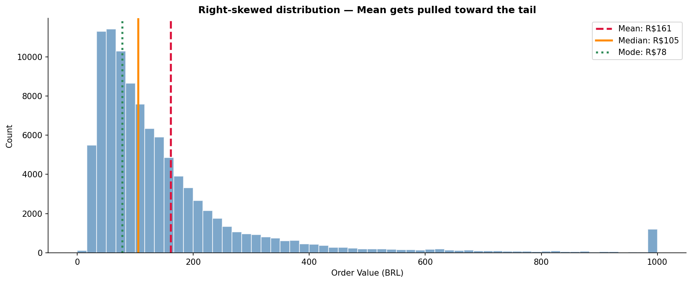

### Spread — Std Dev & Percentiles

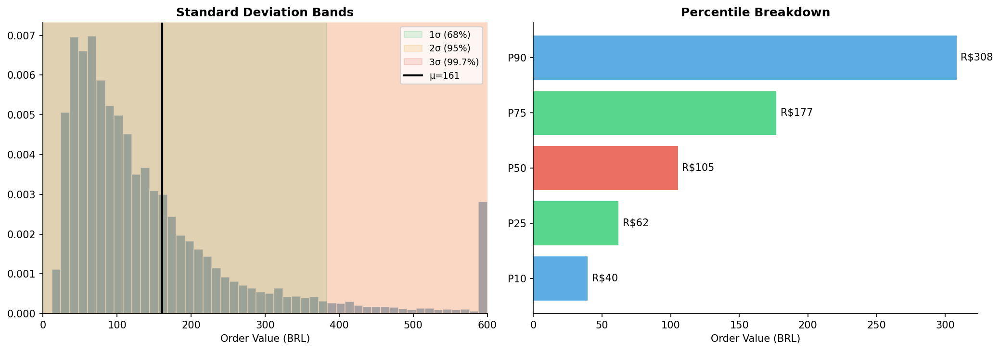

### Frequency Distributions

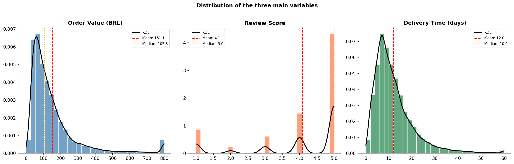

### Boxplots & Outliers
~7% of orders sit above the IQR fence.

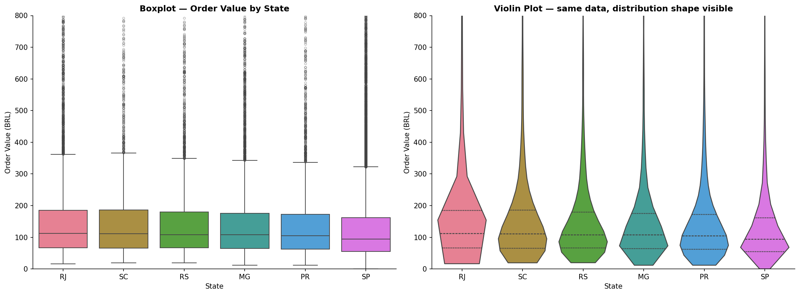

### Normality Check
Raw order values are not normal. Log transform brings them close.

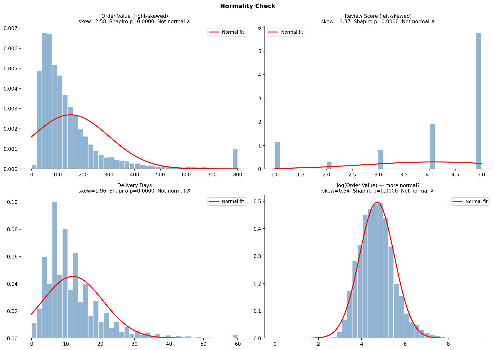
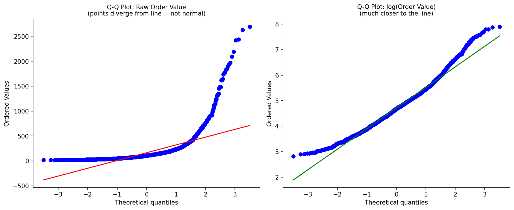

---

## Part 2 — Intermediate Statistics

### How hypothesis testing works
p-value < 0.05 → reject H₀ → the difference is real.

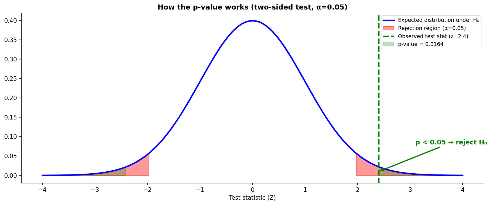

### t-Test: Weekend vs Weekday Orders

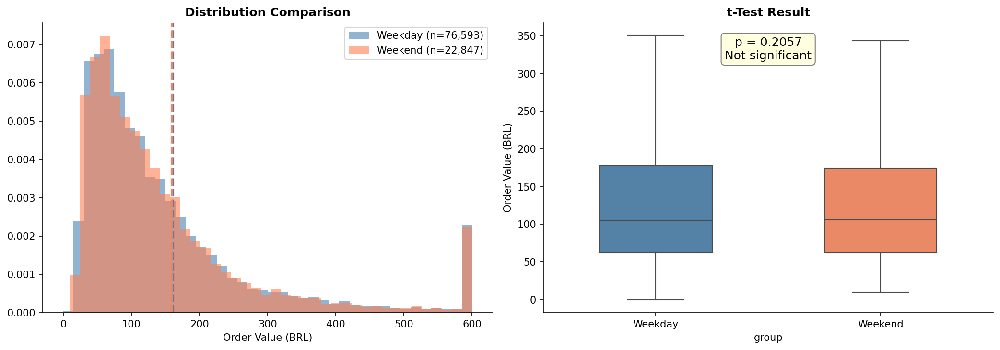

### Chi-Square: Payment Method × Delivery

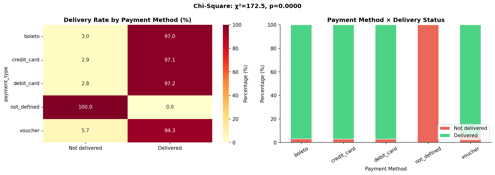

### Correlation
Longer delivery → lower ratings. Both Pearson and Spearman agree.

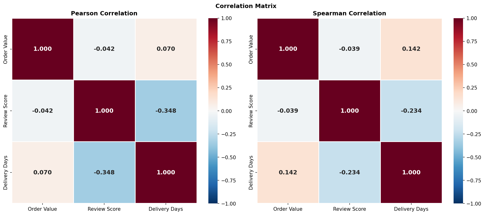
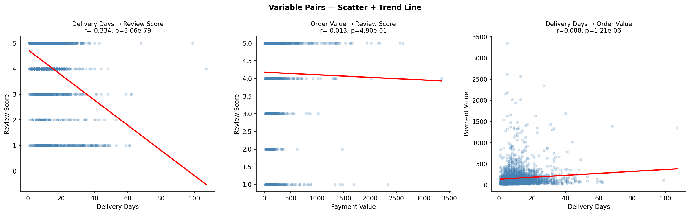

### Simple Linear Regression

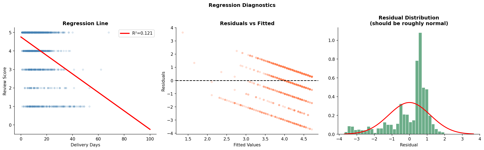

---

## Part 3 — Advanced Statistics

### One-Way ANOVA
Credit card orders are significantly higher in value than other payment methods.

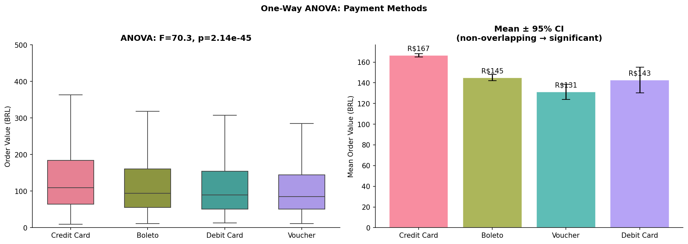

### Multiple Regression
`is_late` is the strongest negative predictor of review score.

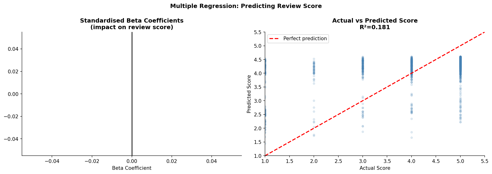

### Bootstrap Confidence Intervals
10,000 resamples — no distribution assumption needed.

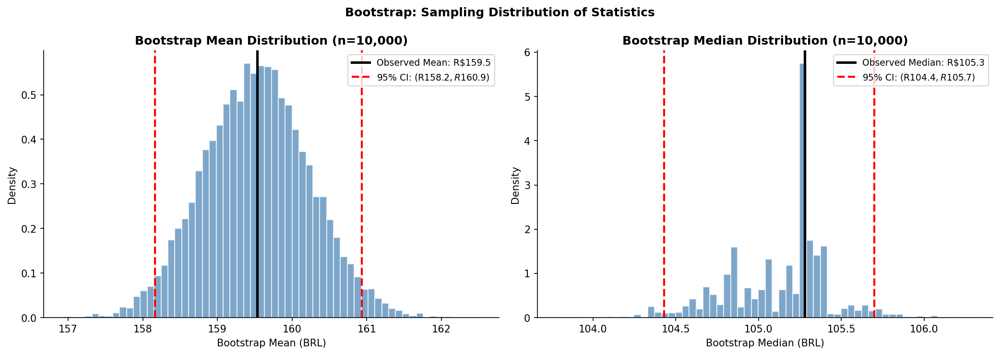

### A/B Test: On-time vs Late Delivery
On-time delivery significantly boosts customer ratings (small but real effect).

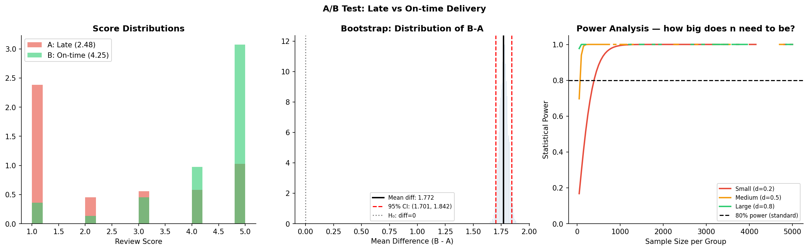

### Confidence Intervals by State

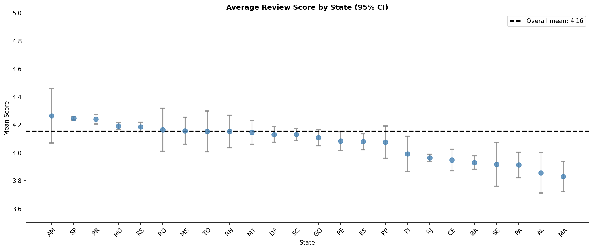

### Kruskal-Wallis: Scores by Month

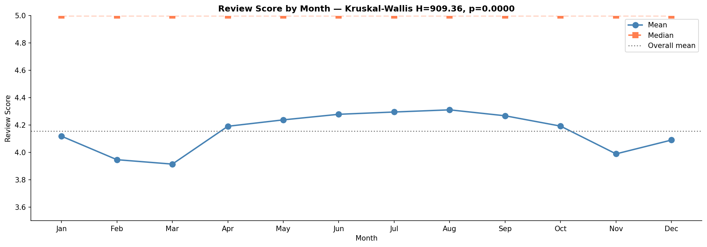

---

## Setup

```bash
git clone https://github.com/sualpsudas/olist-statistics-science.git
cd olist-statistics-science
pip install -r requirements.txt
jupyter notebook
```

Data: [Olist Brazilian E-Commerce — Kaggle](https://www.kaggle.com/datasets/olistbr/brazilian-ecommerce)
